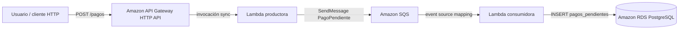

# Flujo serverless NeoPay (complemento al ALB + EC2)

Este documento describe el diseño añadido para cumplir el flujo **pago asíncrono**: API administrada, función productora, cola de mensajes, función consumidora y persistencia en **Amazon RDS PostgreSQL** (misma base que usa la capa de cómputo tradicional).

## Relación con la arquitectura previa

| Componente existente | Rol |
|---------------------|-----|
| VPC, subredes privadas, **NAT Gateway** | La Lambda consumidora corre en subredes de cómputo privadas; el tráfico hacia SQS y CloudWatch usa el NAT. |
| **RDS PostgreSQL** | Almacén de verdad: la consumidora crea la tabla `pagos_pendientes` si no existe e inserta filas por evento. |
| **ALB + ASG (EC2)** | Sigue siendo el camino síncrono para la aplicación web; el flujo de pagos puede invocarse por **HTTP API** sin sustituir al ALB. |

## Diagrama (Mermaid)



## Contrato del mensaje (evento `PagoPendiente`)

Cuerpo JSON mínimo aceptado por `POST /pagos` (campos opcionales salvo los que definas en cliente):

- `payment_id` (opcional): si se omite, la productora genera un UUID.
- `amount`, `currency` (por defecto `USD`).

La cola transporta un JSON con `eventType: "PagoPendiente"`, `paymentId`, `amount`, `currency` y `timestamp` ISO-8601.

## Prueba rápida (tras `terraform apply`)

Reemplaza la URL por el output `pagos_api_invoke_url`:

```bash
curl -X POST "https://<api-id>.execute-api.us-east-1.amazonaws.com/pagos" \
  -H "Content-Type: application/json" \
  -d "{\"amount\": 10.50, \"currency\": \"USD\"}"
```

Respuesta esperada: HTTP **202** con `paymentId` y confirmación de encolado. Tras unos segundos, la fila debería aparecer en la tabla `pagos_pendientes` en RDS.
